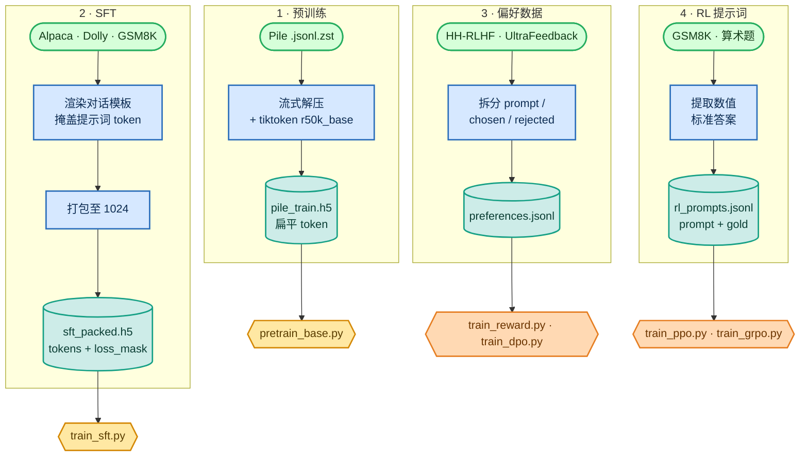

<!-- omit in toc -->
# 数据处理与预处理

每个阶段需要的数据形状都不同，而正确处理这些形状实际上是成功的一半：错位的损失掩码或解析错误的标准答案会悄无声息地毁掉训练。因此，在介绍任何模型代码前，这里会准确说明我如何下载和预处理每个数据集，以及每个训练器期待的格式。

如需了解这些形状背后的第一性原理，请阅读[分词与数据形状](foundations/tokenization_zh.md)。该页面说明了为什么预训练使用扁平 token 流、为什么 SFT 需要 `loss_mask`，以及为什么偏好数据必须保留同一个共享提示词。

这里有**四条**数据流水线，全部使用真实公开数据集：


<details>
<summary>Mermaid 源码（可实时编辑）</summary>



</details>

所有数据都会放在大型 `/ephemeral` 磁盘上，并使用 OpenAI 的 **`r50k_base`** 分词器（`vocab_size = 50304`，唯一的特殊 token 是 `<|endoftext|>` = id `50256`）。

## 1 · 预训练数据（Pile → 扁平 token HDF5）

[`scripts/prepare_pretrain_data.py`](https://github.com/FareedKhan-dev/train-llm-from-scratch/blob/main/scripts/prepare_pretrain_data.py) 会流式读取压缩的 Pile 分片，使用 tiktoken 批量分词，并将一个扁平 `int32` token 数组写入 HDF5（比原先逐文档调整大小的方式快得多）。每个文档都以 `<|endoftext|>` 结束：

```python
for ids in enc.encode_ordinary_batch(docs):
    buf.extend(ids)
    buf.append(EOT_ID)          # 50256 separates documents
    if len(buf) >= WRITE_CHUNK:
        flush()                 # append ~8M tokens to the HDF5 dataset at once
```

```bash
PYTHONPATH=. python scripts/prepare_pretrain_data.py --split val   --out /ephemeral/data/pile_dev.h5
PYTHONPATH=. python scripts/prepare_pretrain_data.py --split train --num_shards 1 --out /ephemeral/data/pile_train.h5
```

基础 [`get_batch_iterator`](https://github.com/FareedKhan-dev/train-llm-from-scratch/blob/main/data_loader/data_loader.py) 随后从这个扁平数组中截取随机的 `context_length + 1` 窗口，用于下一个 token 的训练。

## 2 · SFT 数据（指令 → 打包 token **+ 损失掩码**）

这是容易出错的部分。我们只希望训练模型产生**助手** token，而不是复述提示词。对话格式（[`chat_template.py`](https://github.com/FareedKhan-dev/train-llm-from-scratch/blob/main/src/post_training/chat_template.py)）使用纯文本角色标记（因为 `r50k_base` 没有多余的特殊 token），并以 `<|endoftext|>` 作为轮次终止符：

```
<|user|>
{question}<|endoftext|><|assistant|>
{answer}<|endoftext|>
```

[`encode_chat`](https://github.com/FareedKhan-dev/train-llm-from-scratch/blob/main/src/post_training/chat_template.py#L95) 会构建 token id **以及** 对齐的 `loss_mask`；该掩码仅在助手补全内容（以及它的终止 EOT）上为 `1`：

```python
content_ids = _encode_ordinary(m["content"])
is_completion = role == "assistant"
ids.extend(content_ids)
mask.extend([1 if is_completion else 0] * len(content_ids))   # train ONLY assistant tokens
ids.append(EOT_ID)
mask.append(1 if is_completion else 0)                        # ...and teach it to stop
```

[`prepare_sft_data.py`](https://github.com/FareedKhan-dev/train-llm-from-scratch/blob/main/scripts/prepare_sft_data.py) 会用这个格式渲染 Alpaca、Dolly 和 GSM8K；它还会将 GSM8K 重构为 `<think>…</think><answer>N</answer>` 结构（让模型学习之后 RL 验证器会奖励的精确形状）。随后 [`pack_examples`](https://github.com/FareedKhan-dev/train-llm-from-scratch/blob/main/src/post_training/sft.py#L41) 将所有内容串接并切分为固定的 `1024`-token 行，写入两个对齐的 HDF5 数据集：`tokens` 和 `loss_mask`。

```bash
PYTHONPATH=. python scripts/prepare_sft_data.py --context_length 1024 --out_dir /ephemeral/data
```

我在真实文件中验证过：掩码恰好覆盖 `<answer>4</answer>`，并排除了用户问题；这种对齐正是 SFT 能奏效的原因。

## 3 · 偏好数据（→ `{prompt, chosen, rejected}` JSONL）

[`prepare_preference_data.py`](https://github.com/FareedKhan-dev/train-llm-from-scratch/blob/main/scripts/prepare_preference_data.py) 会获取 **Anthropic/hh-rlhf** 和 **HuggingFaceH4/ultrafeedback_binarized**，并将两者标准化为同一种模式。对于 HH-RLHF，我在最后一个 `Assistant:` 轮次处分割每段对话，使 chosen/rejected 共享同一提示词，仅在最终回复上不同：

```python
def _split_hh(text):
    idx = text.rfind("\n\nAssistant:")
    return text[:idx].strip(), text[idx + len("\n\nAssistant:"):].strip()
```

输出为 `preferences.jsonl`（训练集）和 `preferences_test.jsonl`（保留集，用于衡量奖励模型准确率）。[`preference_dataset.py`](https://github.com/FareedKhan-dev/train-llm-from-scratch/blob/main/data_loader/preference_dataset.py) 通过同一个对话模板为每一侧分词，并对一个批次进行右填充；这很安全，因为模型的注意力是**因果式**的，所以最后一个真实 token 永远不会关注它之后的填充 token（不需要注意力掩码）。

```bash
PYTHONPATH=. python scripts/prepare_preference_data.py --source both --max_per_source 40000
```

## 4 · RL 提示词数据（→ `{prompt, gold}` JSONL）

[`prepare_rl_prompts.py`](https://github.com/FareedKhan-dev/train-llm-from-scratch/blob/main/scripts/prepare_rl_prompts.py) 会将 GSM8K 转换为带有**可验证数值标准答案**的提示词（从数据集的 `#### N` 解析而来），并加入程序化的**算术课程**。即使较弱的策略也能部分解出这些题目，使 RL 从一开始便拥有非零奖励信号：

```python
gold = gsm8k_gold_answer(ex["answer"])           # the number after '####'
rows.append({"prompt": ex["question"].strip(), "gold": gold})
```

```bash
PYTHONPATH=. python scripts/prepare_rl_prompts.py --out_dir /ephemeral/data
```

我曾将生成的标准答案与在线 GSM8K 数据集逐一交叉检查 50/50；它们完全一致。这很重要，因为验证器奖励（[08_evaluation_zh.md](08_evaluation_zh.md)）的可信度完全取决于所比较的标准答案。

## 最终得到的文件

| 文件 | 形状 | 使用方 |
|---|---|---|
| `pile_train.h5` / `pile_dev.h5` | 扁平 `int32` token | 预训练 |
| `sft_packed.h5` | `tokens` + `loss_mask`，`(N, 1024)` | SFT |
| `preferences.jsonl`（+ `_test`） | `{prompt, chosen, rejected}` | 奖励模型、DPO |
| `rl_prompts_train.jsonl` / `_test` | `{prompt, gold}` | PPO、GRPO |
| `arithmetic_prompts.jsonl` | `{prompt, gold}` | GRPO 课程预热 |
<br>

➡️ 下一步：[阶段 1 — 预训练](02_pretraining_zh.md)。
