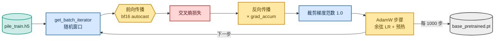

<!-- omit in toc -->
# 阶段 1 — 基础模型预训练

后续所有阶段的效果都取决于基础模型，因此我首先在 Pile 上从头预训练本仓库自有 `Transformer` 的**约 4 亿参数**版本。原始的 [`train_transformer.py`](https://github.com/FareedKhan-dev/train-llm-from-scratch/blob/main/scripts/train_transformer.py) 是一个清晰的单 GPU 循环；针对 2×H100 上的中型模型，我编写了 [`pretrain_base.py`](https://github.com/FareedKhan-dev/train-llm-from-scratch/blob/main/scripts/pretrain_base.py)，在不触及模型本身的前提下，加入这一规模真正需要的功能：DistributedDataParallel、bf16 autocast、梯度累积、带预热的余弦学习率调度，以及定期保存检查点。

如果你不熟悉架构或训练术语，请先阅读基础章节：[仅解码器 Transformer](foundations/transformer_zh.md)、[注意力、掩码与头](foundations/attention_zh.md)、[目标函数、损失与困惑度](foundations/objectives_zh.md)和[优化与训练系统](foundations/optimization_zh.md)。


<details>
<summary>Mermaid 源码（可实时编辑）</summary>



</details>

## 模型

基础配置位于 [`config/post_training_config.py`](https://github.com/FareedKhan-dev/train-llm-from-scratch/blob/main/config/post_training_config.py)（`BaseModelConfig`）：`n_embed=1024, n_head=16, n_blocks=24, context_length=1024`，即约 4.06 亿参数。上下文长度提升到 1024（原来为 512），以便后续容纳 GSM8K 推理链。

## 训练步骤

[`pretrain_base.py`](https://github.com/FareedKhan-dev/train-llm-from-scratch/blob/main/scripts/pretrain_base.py) 的核心是在 bf16 autocast 下进行梯度累积循环，仅在最后一个微步骤中跨 GPU 同步梯度：

```python
for micro in range(cfg.grad_accum):
    xb, yb = next(batch_iter)
    sync = (micro == cfg.grad_accum - 1) or not ctx.enabled
    cm = model.no_sync() if (ctx.enabled and not sync) else _nullcm()
    with cm, amp_autocast(cfg.amp_dtype, ctx.device):   # bf16 on H100, no GradScaler needed
        _, loss = model(xb, yb)
        loss = loss / cfg.grad_accum
    loss.backward()

torch.nn.utils.clip_grad_norm_(model.parameters(), cfg.grad_clip)   # stability
optimizer.step()
```

有几项值得特别说明的选择：

- **bf16 autocast**（[`amp_autocast`](https://github.com/FareedKhan-dev/train-llm-from-scratch/blob/main/src/post_training/utils.py)）不需要 `GradScaler`（与 fp16 不同），因此循环保持简洁。主权重仍为 fp32。
- **带权重衰减分组的 AdamW**（[`configure_optimizer`](https://github.com/FareedKhan-dev/train-llm-from-scratch/blob/main/src/post_training/optim.py)）：对二维权重矩阵施加衰减，绝不对偏置、归一化层或嵌入施加衰减（标准 GPT 配方）。
- **带预热的余弦 LR**（[`cosine_lr`](https://github.com/FareedKhan-dev/train-llm-from-scratch/blob/main/src/post_training/optim.py)）：先在 `warmup_steps` 内线性升高，再以余弦形式衰减至 `min_lr`。
- **DDP**（[`distributed.py`](https://github.com/FareedKhan-dev/train-llm-from-scratch/blob/main/src/post_training/distributed.py)）：每个 rank 使用不同的随机种子打乱数据，因此两张 GPU 会看到不同窗口；仅 rank 0 记录日志和保存检查点。

## 运行

```bash
# single GPU
PYTHONPATH=. python scripts/pretrain_base.py
# both H100s (effective batch = batch_size * grad_accum * num_gpus)
PYTORCH_CUDA_ALLOC_CONF=expandable_segments:True PYTHONPATH=. \
  torchrun --standalone --nproc_per_node=2 scripts/pretrain_base.py \
  --batch_size 8 --grad_accum 12 --train_steps 50000
```

> **为什么使用 `batch_size 8`？** 本仓库的教学型注意力实现会为每个 block 实体化一个 `(B, n_head, T, T)` 张量，因此内存主要由序列长度项主导。在上下文长度为 1024 时，batch size 为 8 可在 DDP 下舒适地装入 80GB H100；我们通过 `grad_accum` 恢复有效 batch size。

## 这些指标代表什么

- **train_loss**：运行中的交叉熵；起始值接近 `ln(vocab) ≈ 10.8`，并应稳定下降（我的结果为 `11.06 → 8.6 → 6.0 → …`）。这是最重要的健康度信号。
- **tok/s**：吞吐量（这里 2×H100 合计约 32k/s）。
- **eval train/dev**：在保留窗口上计算的平均损失，每 `eval_steps` 输出一次；关注 dev loss 以发现过拟合。

检查点每隔 `save_every` 步写入 `/ephemeral/ckpts/base_pretrained.pt`，并携带配置，因此之后的每个阶段都可以借助 [`load_backbone_from_ckpt`](https://github.com/FareedKhan-dev/train-llm-from-scratch/blob/main/src/post_training/utils.py) 重建完全一致的模型。

➡️ 下一步：[阶段 2 — SFT](03_sft_zh.md)。
