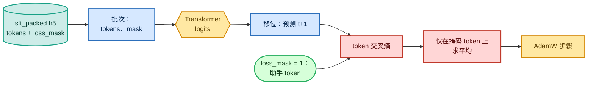

<!-- omit in toc -->
# 阶段 2 — 监督微调（SFT）

基础模型能够续写文本，却不知道自己应该*回答*你的问题。SFT 通过向它展示数千个 `(instruction, response)` 对，并训练它产生**回复**来解决这一问题。与预训练真正的差别只有一个逐 token 的**损失掩码**：我们在助手 token 上计算损失，忽略提示词。

精确的 token / 掩码机制见[分词与数据形状](foundations/tokenization_zh.md)，带掩码的目标函数推导见[目标函数、损失与困惑度](foundations/objectives_zh.md)。


<details>
<summary>Mermaid 源码（可实时编辑）</summary>



</details>

## 带掩码的损失

整个阶段的关键是 [`sft_loss`](https://github.com/FareedKhan-dev/train-llm-from-scratch/blob/main/src/post_training/sft.py#L18)。它是普通的下一个 token 交叉熵，但每个目标位置都会按掩码加权，因此只有补全 token 被计入：

```python
def sft_loss(logits, tokens, loss_mask):
    logits = logits[:, :-1, :]        # predict token t+1 from position t (same shift as pretraining)
    targets = tokens[:, 1:]
    mask = loss_mask[:, 1:].to(logits.dtype)
    V = logits.size(-1)
    ce = F.cross_entropy(logits.reshape(-1, V).float(), targets.reshape(-1).long(), reduction="none")
    ce = ce.view(targets.shape) * mask
    return ce.sum() / mask.sum().clamp(min=1.0)     # mean over ASSISTANT tokens only
```

掩码本身在数据准备阶段由 [`encode_chat`](https://github.com/FareedKhan-dev/train-llm-from-scratch/blob/main/src/post_training/chat_template.py#L95) 生成（见 [01_data_pipeline_zh.md](01_data_pipeline_zh.md)），并与 token 一同打包。对 logits 调用 `.float()` 可以使 bf16 下的交叉熵保持数值稳定。

## 训练器

[`train_sft.py`](https://github.com/FareedKhan-dev/train-llm-from-scratch/blob/main/scripts/train_sft.py) 使用 [`load_backbone_from_ckpt`](https://github.com/FareedKhan-dev/train-llm-from-scratch/blob/main/src/post_training/utils.py) 加载预训练基础模型，随后运行一个紧凑循环：autocast 前向传播、带掩码的损失、梯度裁剪、参数更新和余弦 LR，并定期在 dev 集上评估：

```python
tokens, mask, epoch = next(train_it)
with amp_autocast(cfg.amp_dtype, ctx.device):
    logits, _ = model(tokens)
    loss = sft_loss(logits, tokens, mask)
loss.backward()
torch.nn.utils.clip_grad_norm_(model.parameters(), cfg.grad_clip)
optimizer.step()
```

批次由 [`get_sft_batch_iterator`](https://github.com/FareedKhan-dev/train-llm-from-scratch/blob/main/data_loader/sft_dataset.py) 提供；它将打包后的行分片给各个 DDP rank，并产出 `(tokens, loss_mask, epoch)`。

## 运行

```bash
PYTHONPATH=. python scripts/train_sft.py                                   # single GPU
PYTHONPATH=. torchrun --standalone --nproc_per_node=2 scripts/train_sft.py # both GPUs
# tune: --lr 1e-5 --epochs 3 --batch_size 16
```

## 这些指标代表什么

- **train_loss / ppl**：助手 token 上的带掩码交叉熵（及其困惑度）；应明显低于基础模型的损失。为验证机制，我在 8 行数据上运行了*过拟合*测试，并观察到损失从 `11.0 → 4.7` 快速下降，确认梯度路径能够学习。
- **dev_loss**：保留切分（`sft_dev_packed.h5`）上的同一种带掩码损失；这是诚实的信号。
- **GSM8K dev accuracy**：SFT 后模型既能遵循指令，也会产生 `<answer>…</answer>` 格式，因此该值应高于基础模型（见 [08_evaluation_zh.md](08_evaluation_zh.md)）。

结果会保存为 `/ephemeral/ckpts/sft.pt`，并成为奖励模型、DPO、PPO 和 GRPO 的起点。

➡️ 下一步：[阶段 3 — 奖励模型](04_reward_model_zh.md)，或直接跳至 [DPO](05_dpo_zh.md)。
