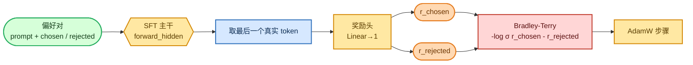

<!-- omit in toc -->
# 阶段 3 — 奖励模型

要实现经典 RLHF（PPO），我们需要某种模型能用一个数字为回复打分：越高代表越受偏好。这就是奖励模型。我通过在 SFT 主干之上添加一个很小的标量头，并使用 **Bradley-Terry** 损失在人类偏好对上进行训练来构建它——这与 InstructGPT 的配方相同。

本页假定你已经了解主干如何产生隐藏状态；如果尚不了解，请从[仅解码器 Transformer](foundations/transformer_zh.md)开始。偏好数据的形状见[分词与数据形状](foundations/tokenization_zh.md)。


<details>
<summary>Mermaid 源码（可实时编辑）</summary>



</details>

## 模型：主干上的标量头

[`RewardModel`](https://github.com/FareedKhan-dev/train-llm-from-scratch/blob/main/src/post_training/reward_model.py#L37) 包装了一个 `Transformer`，去掉 `lm_head`，并从**最后一个真实 token**的隐藏状态读取奖励（InstructGPT 的约定）。由于注意力是因果式的，最后一个 token 已经看过整个序列，且不会关注它之后的右填充，所以不需要注意力掩码：

```python
class RewardModel(nn.Module):
    def __init__(self, transformer):
        self.transformer = transformer
        self.reward_head = nn.Linear(transformer.lm_head.in_features, 1, bias=False)

    def forward(self, idx, seq_lengths=None):
        rewards = self.reward_head(self.transformer.forward_hidden(idx)).squeeze(-1)  # (B, T)
        return gather_last(rewards, seq_lengths)   # reward at the last real token -> (B,)
```

[`gather_last`](https://github.com/FareedKhan-dev/train-llm-from-scratch/blob/main/src/post_training/utils.py) 只是在访问 `rewards[i, seq_lengths[i]-1]`。

## 目标函数：Bradley-Terry

[`bradley_terry_loss`](https://github.com/FareedKhan-dev/train-llm-from-scratch/blob/main/src/post_training/reward_train.py#L18) 会推动 chosen 的奖励高于 rejected。全部训练信号仅此而已：

```python
def bradley_terry_loss(chosen_rewards, rejected_rewards):
    return -F.logsigmoid(chosen_rewards - rejected_rewards).mean()
```

[`preference_accuracy`](https://github.com/FareedKhan-dev/train-llm-from-scratch/blob/main/src/post_training/reward_train.py#L23)——即 `r_chosen > r_rejected` 的对数比例——才是我实际关注的指标。

## 训练器

[`train_reward.py`](https://github.com/FareedKhan-dev/train-llm-from-scratch/blob/main/scripts/train_reward.py) 从 `sft.pt` 初始化主干；随后对于每个批次，将**chosen 和 rejected 序列在一次前向传播中送入模型**（拼接为 `2B`），拆分奖励后应用损失：

```python
ids  = torch.cat([batch["chosen_ids"], batch["rejected_ids"]], dim=0)
lens = torch.cat([batch["chosen_len"], batch["rejected_len"]], dim=0)
rewards = rm(ids, seq_lengths=lens).float()
chosen_r, rejected_r = rewards[:B], rewards[B:]
loss = bradley_terry_loss(chosen_r, rejected_r)
```

样本对来自 [`get_preference_iterator`](https://github.com/FareedKhan-dev/train-llm-from-scratch/blob/main/data_loader/preference_dataset.py)，它会对每个批次进行右填充（在因果注意力下安全），并跟踪每一侧的真实长度。

## 运行

```bash
PYTHONPATH=. python scripts/train_reward.py
PYTHONPATH=. torchrun --standalone --nproc_per_node=2 scripts/train_reward.py
# tune: --lr 1e-5 --max_len 768
```

## 这些指标代表什么

- **loss**：Bradley-Terry 损失；从 `-log σ(0) = 0.693`（随机水平）开始，随着间隔扩大而下降。
- **train_acc / test_acc**：偏好准确率。在干净的测试夹具上会达到 `1.0`；在**真实且有噪声**的 HH-RLHF / UltraFeedback 上，预计约为 **0.65–0.75**——这是正常现象，因为人类偏好本身有噪声。
- **margin**：`r_chosen − r_rejected` 的平均值；用于判断“它是否仍在区分二者”的实用信号。

保存至 `/ephemeral/ckpts/reward.pt`；当指定 `--reward_source rm` 时，PPO 会用 [`load_reward_model`](https://github.com/FareedKhan-dev/train-llm-from-scratch/blob/main/src/post_training/reward_model.py) 加载它。

➡️ 下一步：[阶段 5 — PPO](06_ppo_zh.md)（会消费该模型），或不使用奖励模型的路径：[DPO](05_dpo_zh.md)。
