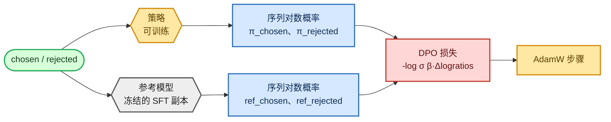

<!-- omit in toc -->
# 阶段 4 — DPO（以及 ORPO / KTO）

直接偏好优化（Direct Preference Optimization, DPO）是绕开 RLHF 的捷径：它不先训练奖励模型再运行 RL 循环，而是直接在偏好对上优化策略，并使用 SFT 模型的冻结副本作为参考锚点。没有奖励模型、没有 rollout、没有 value function，只有一个干净的损失函数。我还在 `--loss_type` 开关下实现了两个流行变体：**ORPO**（无参考模型）和 **KTO**（使用 desirable / undesirable 信号）。

此处使用的序列对数概率记号，见[目标函数、损失与困惑度](foundations/objectives_zh.md)。


<details>
<summary>Mermaid 源码（可实时编辑）</summary>



</details>

## 序列对数概率（共同基础）

DPO 比较相对于参考模型，策略让 chosen 回复比 rejected 回复*更可能*的程度。因此，需要在两个模型下计算**每个回复的对数概率之和**。[`sequence_logprobs`](https://github.com/FareedKhan-dev/train-llm-from-scratch/blob/main/src/post_training/rollout.py#L268) 正是做这件事的函数（PPO / GRPO 也会复用它）：

```python
def sequence_logprobs(model, sequences, response_mask, *, temperature=1.0, requires_grad=True):
    lp, mask = compute_logprobs(model, sequences, response_mask, temperature=temperature, requires_grad=requires_grad)
    m = mask.to(lp.dtype)
    return (lp * m).sum(dim=-1), m.sum(dim=-1)      # (summed logprob, #tokens) per sequence
```

## DPO 损失

[`dpo_loss`](https://github.com/FareedKhan-dev/train-llm-from-scratch/blob/main/src/post_training/dpo.py#L21) 是标准目标函数。β 温度控制它远离参考模型的推动力度：

```python
def dpo_loss(policy_chosen_logps, policy_rejected_logps, ref_chosen_logps, ref_rejected_logps, beta=0.1):
    pi_logratios  = policy_chosen_logps  - policy_rejected_logps
    ref_logratios = ref_chosen_logps     - ref_rejected_logps
    logits = pi_logratios - ref_logratios
    loss = -F.logsigmoid(beta * logits).mean()
    chosen_reward   = beta * (policy_chosen_logps   - ref_chosen_logps).detach()
    rejected_reward = beta * (policy_rejected_logps - ref_rejected_logps).detach()
    return loss, chosen_reward, rejected_reward
```

两个**变体**（[`orpo_loss`](https://github.com/FareedKhan-dev/train-llm-from-scratch/blob/main/src/post_training/dpo.py#L48)、[`kto_loss`](https://github.com/FareedKhan-dev/train-llm-from-scratch/blob/main/src/post_training/dpo.py#L71)）位于同一文件：

- **ORPO**：无参考模型；将 chosen 回复的 SFT 负对数似然与 odds-ratio 偏好项结合，把 SFT + 对齐合并为一个阶段（不需要冻结参考模型）。
- **KTO**：相对于从批次估计的参考 KL 基线，将 chosen 视为 *desirable*、rejected 视为 *undesirable*；当你只有赞 / 踩，而非配对数据时很有用。

## 训练器

[`train_dpo.py`](https://github.com/FareedKhan-dev/train-llm-from-scratch/blob/main/scripts/train_dpo.py) 从 `sft.pt` 加载策略，用 [`make_frozen_copy`](https://github.com/FareedKhan-dev/train-llm-from-scratch/blob/main/src/post_training/utils.py) 创建冻结参考模型（ORPO 会跳过此步骤），并在每一步计算策略 + 参考模型的对数概率：

```python
policy = load_backbone_from_ckpt(cfg, cfg.sft_ckpt, ctx.device)
ref = make_frozen_copy(policy, device=ctx.device) if cfg.loss_type != "orpo" else None
...
loss, cr, rr = _compute_losses(policy, ref, batch, cfg, ctx)   # picks dpo/orpo/kto by cfg.loss_type
loss.backward()
```

## 运行

```bash
PYTHONPATH=. python scripts/train_dpo.py --loss_type dpo  --beta 0.1
PYTHONPATH=. python scripts/train_dpo.py --loss_type orpo --orpo_lambda 1.0
PYTHONPATH=. torchrun --standalone --nproc_per_node=2 scripts/train_dpo.py
```

> DPO 使用**很小**的学习率（默认 `5e-7`）：很容易被过度推离参考模型并导致模型退化，因此应谨慎推进。

## 这些指标代表什么

- **loss**：DPO / KTO 从约 `0.693` 开始；ORPO 的起点更高（包含 NLL 项）。
- **acc**：隐式奖励准确率；策略的隐式奖励偏好 chosen 回复的样本对比例，应升至 0.5 以上。
- **r_chosen / r_rejected**：隐式奖励 `β·(logπ − logref)`；二者间距（margin）应扩大。
- **GSM8K dev accuracy**：真正的下游检查。

保存至 `/ephemeral/ckpts/dpo.pt`。

➡️ 下一步：RL 路径——[PPO](06_ppo_zh.md) 和 [GRPO](07_grpo_zh.md)。
