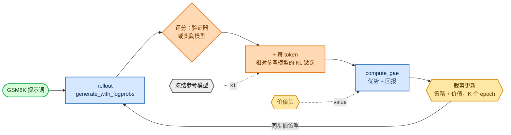

<!-- omit in toc -->
# 阶段 5 — PPO（经典 RLHF）

这是原始的 ChatGPT 配方：让模型生成内容，用奖励为生成结果评分，再借助近端策略优化（Proximal Policy Optimization, PPO）将策略推向更高奖励的行为。同时使用价值网络（critic）降低方差，并通过 KL 惩罚避免它偏离 SFT 模型过远。我从头实现了完整循环：rollout → 奖励 → GAE 优势 → 裁剪更新。

裁剪目标函数和策略比率记号见[目标函数、损失与困惑度](foundations/objectives_zh.md)；优化器与稳定性相关部分见[优化与训练系统](foundations/optimization_zh.md)。


<details>
<summary>Mermaid 源码（可实时编辑）</summary>



</details>

## Actor-critic

PPO 除了策略 logits，还需要每个 token 的价值估计 `V(s_t)`。我通过 [`TransformerWithValueHead`](https://github.com/FareedKhan-dev/train-llm-from-scratch/blob/main/src/post_training/value_head.py#L19) 从一个主干中同时得到两者：它复用 `forward_hidden` + `lm_head` 作为策略，并添加一个很小的标量价值头（初始化为约 0，使 critic 不会在训练初期破坏稳定性）：

```python
def forward(self, idx):
    hidden = self.transformer.forward_hidden(idx)
    logits = self.transformer.lm_head(hidden)      # policy
    values = self.value_head(hidden).squeeze(-1)   # critic, (B, T)
    return logits, values
```

## Rollout 与对数概率

[`rollout_prompts`](https://github.com/FareedKhan-dev/train-llm-from-scratch/blob/main/src/post_training/rollout.py#L180) 会按长度将提示词分桶，并为每个提示词采样补全；[`generate_with_logprobs`](https://github.com/FareedKhan-dev/train-llm-from-scratch/blob/main/src/post_training/rollout.py#L94) 会记录采样时的对数概率。对数概率始终使用 **fp32**（[`compute_logprobs`](https://github.com/FareedKhan-dev/train-llm-from-scratch/blob/main/src/post_training/rollout.py#L233)），因为 PPO 会对它们作差，bf16 舍入在此处会造成损害。

## GAE — 广义优势估计

[`compute_gae`](https://github.com/FareedKhan-dev/train-llm-from-scratch/blob/main/src/post_training/ppo.py#L24) 在“动作帧”中工作（索引 `t` 表示产生 token `t+1`），仅在下一个动作仍是回复 token 时进行 bootstrap：

```python
for t in reversed(range(L)):
    nonterminal = m[:, t + 1] if t + 1 < L else 0.0      # episode ends after the last response token
    delta = rewards[:, t] + gamma * values_next[:, t] * nonterminal - values[:, t]
    lastgae = delta + gamma * lam * nonterminal * lastgae
    adv[:, t] = lastgae
returns = adv + values
```

逐 token 奖励由每个回复 token 上的**相对参考模型 KL 惩罚**构成，再在**最后一个**回复 token 上加上标量任务奖励。随后使用 [`whiten`](https://github.com/FareedKhan-dev/train-llm-from-scratch/blob/main/src/post_training/ppo.py#L60) 对优势进行归一化。

## 裁剪目标函数

[`ppo_policy_loss`](https://github.com/FareedKhan-dev/train-llm-from-scratch/blob/main/src/post_training/ppo.py#L68) 是标准的裁剪替代目标函数；[`ppo_value_loss`](https://github.com/FareedKhan-dev/train-llm-from-scratch/blob/main/src/post_training/ppo.py#L84) 也会裁剪价值更新：

```python
ratio = torch.exp(new_logp - old_logp)
surr1 = ratio * advantages
surr2 = torch.clamp(ratio, 1.0 - clip, 1.0 + clip) * advantages
loss  = -masked_mean(torch.min(surr1, surr2), mask)
```

[`train_ppo.py`](https://github.com/FareedKhan-dev/train-llm-from-scratch/blob/main/scripts/train_ppo.py) 将这些部分串联起来：先 rollout 一次，计算旧对数概率 / 参考对数概率 / 价值，构建奖励并计算 GAE，随后运行 `ppo_epochs` 轮按小批次划分的裁剪更新。

## 运行

```bash
PYTHONPATH=. python scripts/train_ppo.py --reward_source verifier   # GSM8K checker as reward
PYTHONPATH=. python scripts/train_ppo.py --reward_source rm         # use the trained reward.pt
PYTHONPATH=. torchrun --standalone --nproc_per_node=2 scripts/train_ppo.py
```

## 这些指标代表什么

- **reward**：每轮迭代的平均任务奖励；最核心的曲线，应呈上升趋势。
- **KL_ref**：策略相对 SFT 参考模型的平均 KL，必须保持**有界**。若它暴涨，说明模型正在退化——降低学习率或提高 `--kl_coef`。
- **clipfrac**：触及 PPO 裁剪范围的 token 比例；一个反映健康度 / 步长的信号。
- **value_loss**：critic 回归误差。
- **GSM8K test accuracy**：真正的结果，每隔 `--eval_every` 次评估。

> PPO 是最敏感的部分：使用小学习率（`1e-6`）、`clip 0.2`、梯度裁剪 1.0，并关注 KL。我通过给它一个可学习的合成奖励验证该循环确实在*优化*：奖励从 `0.10 → 1.00` 上升。

保存至 `/ephemeral/ckpts/ppo.pt`。

➡️ 下一步：[阶段 6 — GRPO](07_grpo_zh.md)，它完全去掉了 critic。
