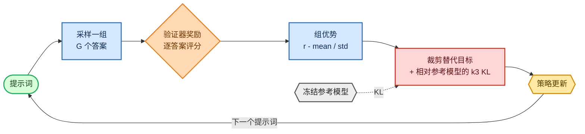

<!-- omit in toc -->
# 阶段 6 — GRPO / RLVR（推理前沿）

GRPO（Group Relative Policy Optimization，组相对策略优化）是 DeepSeek-R1 背后的算法，且它优雅地简单：**抛弃 PPO 的价值网络**。对于每个提示词，采样一整*组*答案，用可验证奖励为其评分，并使用该组自身的均值 / 标准差作为基线。优势仅仅是“这个答案比同组其他答案好多少？”——无需训练 critic，也没有 value loss。

组相对优势公式及其与 PPO 风格策略比率的关系，见[目标函数、损失与困惑度](foundations/objectives_zh.md)。


<details>
<summary>Mermaid 源码（可实时编辑）</summary>



</details>

## 组相对优势

[`group_advantages`](https://github.com/FareedKhan-dev/train-llm-from-scratch/blob/main/src/post_training/grpo.py#L17) 就是整个核心思想：在**每一组内部**标准化奖励，因此好答案是指在同一提示词下击败其同组答案的答案：

```python
def group_advantages(rewards, group_size, eps=1e-4):
    r = rewards.view(-1, group_size)             # rewards laid out group-contiguously
    adv = (r - r.mean(1, keepdim=True)) / (r.std(1, keepdim=True) + eps)
    return adv.reshape(-1)
```

它有一个很好的性质：如果组内每个答案获得相同奖励（全对或全错），基于标准差的优势约为 0，该组便不会贡献梯度。因此我会将*信息量充足*组的比例记录为健康度指标。

## 损失：裁剪替代目标 + KL

[`grpo_loss`](https://github.com/FareedKhan-dev/train-llm-from-scratch/blob/main/src/post_training/grpo.py#L37) 使用与 PPO 相同的、逐 token 的裁剪替代目标（将优势广播到一个补全的所有 token），并用 Schulman 的非负 **k3** 估计器（[`k3_kl`](https://github.com/FareedKhan-dev/train-llm-from-scratch/blob/main/src/post_training/grpo.py#L31)）对参考模型施加逐 token KL 惩罚：

```python
ratio = torch.exp(new_logp - old_logp)
surrogate = torch.min(ratio * adv, torch.clamp(ratio, 1 - clip, 1 + clip) * adv)
kl = k3_kl(new_logp, ref_logp)                  # exp(Δ) - Δ - 1, always ≥ 0
loss = -masked_mean(surrogate - kl_coef * kl, resp_mask)
```

## 训练器与课程

[`train_grpo.py`](https://github.com/FareedKhan-dev/train-llm-from-scratch/blob/main/scripts/train_grpo.py) 从 `sft.pt` 加载策略，将每个提示词复制 `G` 次（按组连续排列），执行 rollout，用 GSM8K 验证器评分，并更新模型。它会在前 `--curriculum_iters` 次迭代中运行**算术课程**，使策略在面对完整 GSM8K 之前先获得一些奖励（否则每组都可能全错，从而没有信号）：

```python
rows = next(warm_it if it < cfg.curriculum_iters else main_it)
prompts = [p for p in base_prompts for _ in range(G)]            # group-contiguous
rewards = torch.tensor([reward_gsm8k(responses[i], golds[i]) for i in range(len(prompts))])
adv = group_advantages(rewards, G)
```

## 运行

```bash
PYTHONPATH=. python scripts/train_grpo.py --group_size 8
PYTHONPATH=. torchrun --standalone --nproc_per_node=2 scripts/train_grpo.py
# tune: --curriculum_iters 100 --kl_coef 0.04 --temperature 1.0
```

## 这些指标代表什么

- **reward**：所有组内采样的平均验证器奖励；希望看到它上升。
- **informative**：奖励非零离散度的组比例（即真正能提供学习信号的组）。若它降至 0，应提高 temperature / group size，或在课程阶段停留更久。
- **KL**：相对参考模型的 KL；保持有界。
- **GSM8K test accuracy**：最核心的推理指标，每隔 `--eval_every` 次评估。

> 我验证过 GRPO 路径确实在优化：使用可学习奖励时，平均奖励在约 15 次迭代内从 **`0.10 → 0.69 → 1.00`** 上升并饱和。PPO 和 GRPO 共用相同的 rollout / 对数概率核心，因此这也覆盖了共用机制。

保存至 `/ephemeral/ckpts/grpo.pt`。

➡️ 下一步：[在 GSM8K 上衡量所有阶段](08_evaluation_zh.md)，并[与结果对话](09_inference_zh.md)。
