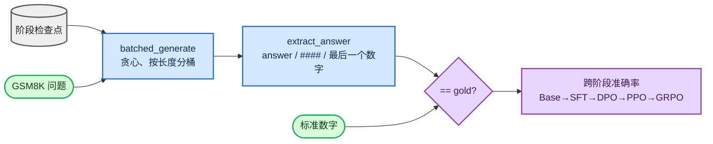

<!-- omit in toc -->
# 评估

只有能够衡量的流水线才可信，因此我会用贪心解码在**同一份**保留 GSM8K 测试集上评估每个阶段。核心交付物是一张表：GSM8K 准确率如何从 Base → SFT → DPO → PPO → GRPO 变化。奖励是*可验证的*：我解析模型的最终数字，并将它与标准答案比较，因此分数是客观结果，不是主观判断。


<details>
<summary>Mermaid 源码（可实时编辑）</summary>



</details>

## 生成：按长度分桶的贪心解码

教学模型没有支持 padding 的注意力掩码，因此 [`batched_generate`](https://github.com/FareedKhan-dev/train-llm-from-scratch/blob/main/src/post_training/evaluation.py#L24) 会将长度相同的提示词分到同一桶中一起解码；`greedy=True` 强制采用 argmax（`top_k=1`），从而得到可比较且确定的数值。

## 评分：可验证奖励

[`gsm8k_accuracy`](https://github.com/FareedKhan-dev/train-llm-from-scratch/blob/main/src/post_training/evaluation.py#L77) 为每个问题生成答案，并用验证器进行检查：

```python
prompts = [encode_prompt([{"role": "user", "content": q}]) for q, _ in qa_pairs]
responses = batched_generate(model, prompts, max_new_tokens, device=device, greedy=greedy)
correct = sum(is_correct(resp, gsm8k_gold_answer(ans)) for (q, ans), resp in zip(qa_pairs, responses))
```

奖励 / 检查器位于 [`rewards/`](https://github.com/FareedKhan-dev/train-llm-from-scratch/blob/main/src/post_training/rewards/)。`extract_answer` 具有容错性：它优先匹配 `<answer>…</answer>` 标签，然后匹配 GSM8K 风格的 `#### N`，最后退回到文本中的最后一个数字。[`reward_gsm8k`](https://github.com/FareedKhan-dev/train-llm-from-scratch/blob/main/src/post_training/rewards/verifiers.py#L35) 以**正确性为主导**，只提供很小且有上限的格式奖励，以避免奖励投机：

```python
r = 0.0
if _answers_match(extract_answer(text), gold): r += 1.0     # the reward that matters
if has_well_formed_answer(text):               r += 0.2     # small format nudge
return min(r, 1.2)                                           # clipped
```

我曾独立于任何模型检查这个评分器：输入正确答案得到 **100/100** 分，错误答案的误报为 **0/100**；标准答案也与在线 GSM8K 数据集交叉验证过。

## 跨阶段表格

[`eval_post_training.py`](https://github.com/FareedKhan-dev/train-llm-from-scratch/blob/main/scripts/eval_post_training.py) 可加载任何检查点（从存储的 `cfg` 读取维度），对其评分，并向 JSONL 追加一行，之后可将其渲染为表格：

```bash
for s in base_pretrained sft dpo ppo grpo; do
  PYTHONPATH=. python scripts/eval_post_training.py --ckpt /ephemeral/ckpts/$s.pt \
    --label $s --limit 200 --append /ephemeral/logs/stage_table.jsonl
done
PYTHONPATH=. python scripts/eval_post_training.py --table /ephemeral/logs/stage_table.jsonl
```

```
stage              GSM8K acc       n
------------------------------------
base_pretrained         ...      200
sft                     ...      200
dpo                     ...      200
ppo                     ...      200
grpo                    ...      200
```

## 训练过程中的指标

每个训练器也会在 `/ephemeral/logs/` 下写入指标 JSONL（通过 [`MetricsLogger`](https://github.com/FareedKhan-dev/train-llm-from-scratch/blob/main/src/post_training/logging_utils.py)）：SFT 的 train/dev loss、奖励模型的偏好准确率、DPO 的隐式奖励准确率，以及 PPO / GRPO 的 reward / KL / 裁剪比例 + GSM8K 准确率。传入 `--use_wandb true` 还可镜像到 Weights & Biases；JSONL 始终会写入，因此也能离线绘图。

## 在这个规模下“好”的表现

从头训练的约 4 亿参数模型不会登顶 GSM8K 排行榜——重点在于各阶段之间的**相对**提升，以及 RL 期间保持有界的 KL。绝对数字可以不高，但每一步都应呈现清晰且真实的前后改善。

➡️ 下一步：[与任意检查点对话](09_inference_zh.md)。
