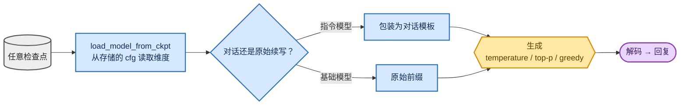

<!-- omit in toc -->
# 推理与对话

只有能够实际*对话*，训练才令人满足。原始的 [`generate_text.py`](https://github.com/FareedKhan-dev/train-llm-from-scratch/blob/main/scripts/generate_text.py) 为基础模型做原始续写，但它固定使用旧版配置，也没有对话模板。因此我新增了一层小型推理层，可加载**任意**阶段的检查点（base / SFT / DPO / PPO / GRPO），并以正确方式与之交互。

关于底层解码循环、上下文裁剪、temperature 与停止 token 行为，请阅读[生成与采样](foundations/generation_zh.md)。


<details>
<summary>Mermaid 源码（可实时编辑）</summary>



</details>

## 根据存储配置加载任意检查点

[`load_model_from_ckpt`](https://github.com/FareedKhan-dev/train-llm-from-scratch/blob/main/src/post_training/inference.py) 会从检查点保存的 `cfg` 读取模型维度，因此不需要再次指定 `n_embed` / `n_blocks`，并能够处理 DDP / reward-head 的键前缀：

```python
ck = torch.load(ckpt_path, map_location="cpu", weights_only=False)
cfg = {**(ck.get("cfg") or {}), **(overrides or {})}
model = Transformer(n_head=cfg["n_head"], n_embed=cfg["n_embed"], ...)
state = {k.removeprefix("module.").removeprefix("transformer."): v for k, v in state.items()}
```

## 对话与原始续写

[`generate_reply`](https://github.com/FareedKhan-dev/train-llm-from-scratch/blob/main/src/post_training/inference.py#L37) 有两种模式，并复用了与训练 / 评估相同且经过测试的生成核心（[`batched_generate`](https://github.com/FareedKhan-dev/train-llm-from-scratch/blob/main/src/post_training/evaluation.py#L24)）：

- **chat**（默认）：将文本包装进对话模板（可选 `system` 消息），并返回解码后的助手轮次。用于 SFT / DPO / PPO / GRPO 检查点。
- **raw**（`--raw`）：将文本视作前缀，并返回基础模型的续写（无模板）。用于 `base_pretrained.pt`。

```python
if raw:
    ids = get_tokenizer().encode_ordinary(user_text)
else:
    ids = encode_prompt([{"role": "user", "content": user_text}])   # ...ends at <|assistant|>
out = batched_generate(model, [ids], max_new_tokens, device=device,
                       temperature=temperature, top_k=top_k, top_p=top_p, greedy=greedy)
```

解码具有防御性：[`decode`](https://github.com/FareedKhan-dev/train-llm-from-scratch/blob/main/src/post_training/chat_template.py) 会移除 EOT 终止符和任何 padding-vocab id（模型的词表填充至 50304，但 r50k_base 只能解码 0–50255）。

## CLI

[`scripts/chat.py`](https://github.com/FareedKhan-dev/train-llm-from-scratch/blob/main/scripts/chat.py) 可用于单次调用或交互式 REPL：

```bash
# instruction-tuned models (chat template applied automatically)
PYTHONPATH=. python scripts/chat.py --ckpt /ephemeral/ckpts/sft.pt  --prompt "What is 13 + 29?"
PYTHONPATH=. python scripts/chat.py --ckpt /ephemeral/ckpts/grpo.pt --prompt "..." --greedy
# base-model continuation
PYTHONPATH=. python scripts/chat.py --ckpt /ephemeral/ckpts/base_pretrained.pt --raw --prompt "Once upon a time"
# interactive REPL (omit --prompt)
PYTHONPATH=. python scripts/chat.py --ckpt /ephemeral/ckpts/sft.pt
```

采样控制项包括：`--temperature`、`--top_p`、`--top_k`，以及用于确定性 argmax 的 `--greedy`。可在 `--device cuda` 或 `cpu` 上运行（两者均已验证）。

## 简述采样旋钮

- **greedy**：可复现，最适合评估 / 数学题（`--greedy`）。
- **temperature**：越高越随机；开放式对话通常使用约 `0.7–1.0`。
- **top_p / top_k**：nucleus / top-k 截断，用于去掉低概率 token 的长尾。

这就是完整闭环：预训练 → 对齐 → 推理 → 衡量 → 对话。返回[概览](README_zh.md)。
