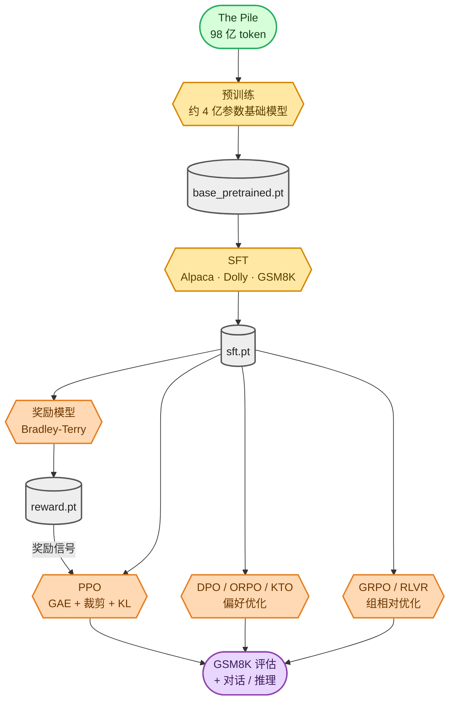

<!-- omit in toc -->
# 后训练与对齐 — 概览

我第一次从头训练这个 Transformer 时，它能够*续写*文本，却不会*遵循指令*或*推理*。后训练正是为了解决这些问题。本 `docs/` 目录讲述了我在基础模型之上构建的完整流程：每个阶段都使用纯 PyTorch 从头实现（不依赖 `trl`、`peft` 或 `transformers`），在真实公开数据集上训练，既可在单张 GPU 上运行，也可通过 DDP 扩展到多张 GPU。

如果你刚开始了解 LLM 训练的内部机制，请先阅读新的 **[LLM 基础](foundations/README_zh.md)** 部分，再阅读各阶段页面。它解释了后续每个页面都会用到的 token 形状、仅解码器 Transformer、注意力掩码、目标函数、优化循环和生成机制。

## 推荐阅读顺序

1. **先读基础知识**：
   [分词](foundations/tokenization_zh.md) ->
   [Transformer](foundations/transformer_zh.md) ->
   [注意力](foundations/attention_zh.md) ->
   [目标函数](foundations/objectives_zh.md) ->
   [优化](foundations/optimization_zh.md) ->
   [生成](foundations/generation_zh.md)。
2. **再读完整流水线**：
   [数据](01_data_pipeline_zh.md) ->
   [预训练](02_pretraining_zh.md) ->
   [SFT](03_sft_zh.md) ->
   [奖励模型](04_reward_model_zh.md) ->
   [DPO](05_dpo_zh.md) ->
   [PPO](06_ppo_zh.md) ->
   [GRPO](07_grpo_zh.md)。
3. **最后运行并检查**：
   [评估](08_evaluation_zh.md)、[推理 / 对话](09_inference_zh.md)，以及[命令速查表](howto/commands_zh.md)。

这条流水线与现代对齐 / 推理模型的实际构建方式相对应：


<details>
<summary>Mermaid 源码（可实时编辑）</summary>



</details>

## 各阶段概览

| # | 阶段 | 模型学习的内容 | 文档 |
|---|---|---|---|
| 1 | **预训练** | 语言本身（在 The Pile 上预测下一个 token） | [02_pretraining_zh.md](02_pretraining_zh.md) |
| 2 | **SFT** | 遵循指令并产生 `<think>/<answer>` 格式 | [03_sft_zh.md](03_sft_zh.md) |
| 3 | **奖励模型** | 为人类偏好的答案打分 | [04_reward_model_zh.md](04_reward_model_zh.md) |
| 4 | **DPO / ORPO / KTO** | 无需 RL 循环即可偏好更好的答案 | [05_dpo_zh.md](05_dpo_zh.md) |
| 5 | **PPO** | 通过经典 RLHF 循环，最大化奖励（奖励模型或验证器） | [06_ppo_zh.md](06_ppo_zh.md) |
| 6 | **GRPO / RLVR** | 使用可验证奖励进行推理（DeepSeek-R1 风格） | [07_grpo_zh.md](07_grpo_zh.md) |
| — | **数据流水线** | 上述每个数据集的下载与预处理方式 | [01_data_pipeline_zh.md](01_data_pipeline_zh.md) |
| — | **评估** | 如何衡量所有阶段的 GSM8K 准确率 | [08_evaluation_zh.md](08_evaluation_zh.md) |
| — | **推理 / 对话** | 如何实际与任意检查点交互 | [09_inference_zh.md](09_inference_zh.md) |

## 唯一的设计规则：*包装，不重写*

这里的一切都构建在原始 [`Transformer`](https://github.com/FareedKhan-dev/train-llm-from-scratch/blob/main/src/models/transformer.py) 之上。我只在教学模型中改动了**一处**：新增了 [`forward_hidden`](https://github.com/FareedKhan-dev/train-llm-from-scratch/blob/main/src/models/transformer.py#L56) 方法，返回 `lm_head` 所消费的最终隐藏状态。每个后训练头部（PPO 的 value head、奖励模型的标量奖励头）和每一次 RL 对数概率计算都围绕这一个方法进行组合，因此你已经理解的从头实现模型仍保持完整。

## 颜色图例（本目录每张图中均会使用）

🟩 数据 / 语料库 · 🟦 预处理 · 🟦‍⬛ 存储（HDF5 / JSONL） · 🟨 模型 / 训练循环 · 🟧 RL / 奖励 · 🟥 损失 / 目标函数 · 🟪 评估 · ⬜ 检查点

> 每张图都是手绘风格、带颜色编码的 Mermaid 草图，**预先渲染为 PNG 并作为图片嵌入**（GitHub 的 Mermaid 实时渲染并不稳定地支持 `look: handDrawn`；有些查看器，例如 VS Code 预览，也会阻止 SVG，因此嵌入 PNG 可以在任何位置显示）。每张图片下方的可折叠 *“Mermaid 源码”* 区块中都保留了可编辑源文件。编辑后如需重新生成图片，请参见 [diagrams/README_zh.md](diagrams/README_zh.md)。

## 运行完整流程

基础模型预训练完成后（[02_pretraining_zh.md](02_pretraining_zh.md)），整条链路只需运行一个脚本：

```bash
bash scripts/run_posttraining.sh          # SFT -> RM -> DPO -> PPO -> GRPO -> eval table
```

精简的命令参考见 [POST_TRAINING.md](https://github.com/FareedKhan-dev/train-llm-from-scratch/blob/main/POST_TRAINING.md)。
