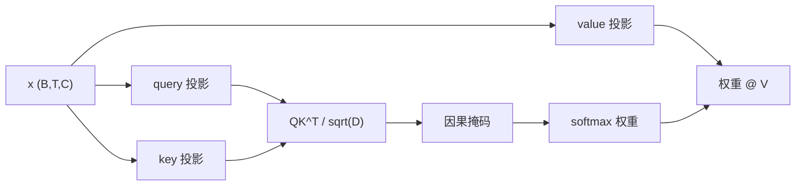

# 注意力、掩码与头

自注意力这一运算使每个 token 能够决定此前哪些 token 更重要。

在仅解码器语言模型中，位置 \(t\) 可以使用位置 \(0..t\) 的信息，但不能使用位置 \(t+1..T-1\) 的信息。这个限制使下一个 token 训练保持诚实。

## 注意力方程

对于输入张量 \(X \in \mathbb{R}^{B \times T \times C}\)，一个注意力头会学习三个线性投影：

\[
Q = X W_Q,\quad K = X W_K,\quad V = X W_V
\]

其中 \(Q,K,V \in \mathbb{R}^{B \times T \times D}\)。

缩放点积注意力为：

\[
\text{Attention}(Q,K,V)
= \text{softmax}\left(\frac{QK^T}{\sqrt{D}} + M\right)V
\]

掩码 \(M\) 在允许的位置为 `0`，在未来位置为 \(-\infty\)。

## Query、key、value 的直觉

对于每个 token：

- query：“我在寻找什么？”
- key：“我包含什么信息？”
- value：“如果被选中，我应向后传递什么内容？”

点积 \(q_t \cdot k_s\) 衡量 token \(t\) 想从 token \(s\) 获取信息的程度。

## 为什么要除以 \(\sqrt{D}\)？

如果 query 和 key 的分量方差大致为 1，它们的点积方差会与 \(D\) 成比例。更大的单头维度会产生很大的 logits，使 softmax 过于尖锐、梯度变弱。该缩放因子将注意力 logits 保持在更稳定的范围：

\[
\frac{q_t \cdot k_s}{\sqrt{D}}
\]

## 因果掩码

对于 \(T=5\)，允许的注意力模式为：

\[
\begin{bmatrix}
1 & 0 & 0 & 0 & 0 \\
1 & 1 & 0 & 0 & 0 \\
1 & 1 & 1 & 0 & 0 \\
1 & 1 & 1 & 1 & 0 \\
1 & 1 & 1 & 1 & 1
\end{bmatrix}
\]

本仓库将其保存为下三角 buffer：

```python
self.register_buffer("tril", torch.tril(torch.ones(context_length, context_length)))
```

随后在 softmax 前掩盖未来位置：

```python
attn_weights = q @ k.transpose(-2, -1) * scale_factor
attn_weights = attn_weights.masked_fill(self.tril[:T, :T] == 0, float("-inf"))
attn_weights = F.softmax(attn_weights, dim=-1)
out = attn_weights @ v
```

未来位置的 logits 变为 \(-\infty\)，因此它们的 softmax 概率为零。



## 多头注意力

一个头只有一种注意力模式。多个头使模型能并行学习多种模式：

- 语法依赖；
- 重复出现的名称或实体；
- 局部短语结构；
- 分隔符与格式跟踪；
- 算术或类似代码的依赖。

本仓库创建 `n_head` 个独立的 `Head` 模块：

```python
self.heads = nn.ModuleList([
    Head(n_embed // n_head, n_embed, context_length)
    for _ in range(n_head)
])
self.proj = nn.Linear(n_embed, n_embed)
```

随后串接每个头的输出：

```python
x = torch.cat([h(x) for h in self.heads], dim=-1)
x = self.proj(x)
```

若 \(H\) 个头各输出宽度 \(D=C/H\)，串接后会恢复为宽度 \(C\)：

\[
\text{Concat}(\text{head}_1,\ldots,\text{head}_H) \in \mathbb{R}^{B \times T \times C}
\]

最终投影会混合不同头的信息。

## 注意力成本

每个头的注意力分数矩阵形状为：

\[
B \times T \times T
\]

有 \(H\) 个头时，核心分数存储量约为：

\[
O(BHT^2)
\]

这就是上下文长度昂贵的原因。将 \(T\) 翻倍，注意力矩阵大小约增加四倍。本仓库的教学型注意力实现有意保持可读性，并直接实体化这些矩阵。

## 注意力能做与不能做的事

注意力在位置间混合信息。它本身不能：

- 创建词表上的概率分布；
- 在没有位置信息时获知 token 顺序；
- 执行加权平均之外的非线性变换。

这些职责由位置嵌入、MLP、层归一化、残差路径和最终 LM head 承担。

## 从心智模型调试注意力

如果训练表现异常，请问自己：

1. 掩码是因果式的吗，还是 token 能看到答案？
2. `q`、`k`、`v` 是否由同一个归一化后的输入投影而来？
3. `head_size = n_embed // n_head` 是整数吗？
4. 串接所有头后是否恰好得到 `n_embed` 个通道？
5. 序列长度 `T` 是否小于或等于 `context_length`？

## 下一步

注意力会创建隐藏状态。损失函数决定隐藏状态如何成为学习信号。继续阅读[目标函数、损失与困惑度](objectives_zh.md)。
