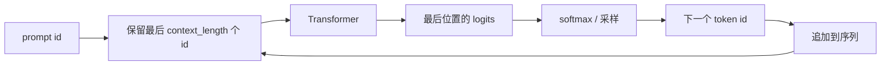

# 生成与采样

训练会针对已知文本预测下一个 token。生成则将模型自己采样出的 token 作为下一个输入。

这个反馈循环正是很小的概率差异能够产生截然不同补全结果的原因。

## 自回归循环



`src/models/transformer.py` 中的简单实现：

```python
for _ in range(max_new_tokens):
    idx_cond = idx[:, -self.context_length:]
    logits, _ = self(idx_cond)
    logits = logits[:, -1, :]
    probs = F.softmax(logits, dim=-1)
    idx_next = torch.multinomial(probs, num_samples=1)
    idx = torch.cat((idx, idx_next), dim=1)
```

只使用最后一个位置，是因为该位置已经关注了整个当前上下文。

## 贪心解码与采样

贪心解码选择：

\[
\arg\max_i p_i
\]

采样则从下列分布抽取：

\[
x \sim \text{Categorical}(p)
\]

贪心解码是确定性的，且常会重复。采样具有随机性，能够产生更多样的文本。

本仓库简单的基础 `generate` 方法会直接从完整 softmax 分布采样。后训练推理工具提供了更多控制项。

## Temperature

Temperature 会在 softmax 前缩放 logits：

\[
p_i =
\frac{\exp(z_i / \tau)}
{\sum_j \exp(z_j / \tau)}
\]

影响如下：

- \(\tau < 1\)：分布更尖锐，更稳妥但多样性较低；
- \(\tau = 1\)：不变；
- \(\tau > 1\)：分布更平坦，更多样但更容易出错。

Temperature 操作的是 logits，而不是概率。

## Top-k 与 top-p

许多生成系统会在采样前限制候选集合。

Top-k 仅保留概率最高的 \(k\) 个 token。

Top-p（也称 nucleus sampling）保留累积概率至少达到 \(p\) 的最小 token 集合。

这些控制项不是基础模型架构的一部分；它们是叠加在模型 logits 之上的解码策略。

## 上下文裁剪

模型有一个固定的最大上下文长度：

```python
idx_cond = idx[:, -self.context_length:]
```

若对话长度超过该上限，最旧 token 会被丢弃。模型无法关注保留上下文窗口之外的文本。

这也是为什么上下文长度是产品约束，而不只是一个训练超参数。

## 停止 token

分词器的 EOT token 为：

```python
EOT_ID = 50256
```

训练期间，EOT 出现在文档之间和每条助手消息之后。推理期间，当 EOT 出现或格式化答案完成时，对话循环可以停止。

如果模型从未被训练为输出清晰的停止 token 或答案分隔符，解码时就只能猜测何时停止。

## 为什么生成的文本会漂移

在 teacher-forced 训练中，每个输入前缀都来自数据集。生成时，前缀来自模型本身。若模型在初期采样到一个较差 token，之后的预测都会以该较差 token 为条件。

这种分布偏移正是后训练重要的原因之一：

- SFT 教会答案格式；
- 奖励 / 偏好方法将模型推向更受偏好的补全；
- RLVR / GRPO 能够奖励满足外部验证器的最终答案。

## 有用的生成诊断

| 症状 | 可能原因 | 检查方法 |
|---|---|---|
| 无限重复 | 分布过于尖锐，或没有学到停止行为 | 降低最大 token 数，检查 EOT 处理，调整采样 |
| 忽略指令 | 基础模型未经过足够 SFT | 测试 SFT 检查点 |
| 答案格式错误 | SFT 数据格式不匹配 | 检查对话模板和掩码 |
| 文本看似随机 | 模型训练不足或 temperature 过高 | 对比 train/dev loss 并降低 temperature |
| 长提示词时崩溃 | prompt 超出上下文或设备内存 | 裁剪上下文并检查 `context_length` |

## 下一步

至此，你已具备理解完整流水线的基础。继续阅读：

- [数据处理](../01_data_pipeline_zh.md)
- [预训练](../02_pretraining_zh.md)
- [SFT](../03_sft_zh.md)
