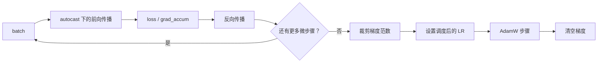
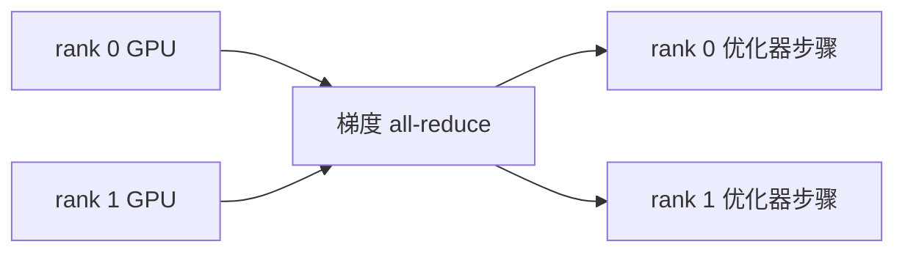

# 优化与训练系统

一旦定义了损失，训练就成为一个工程问题：在避免数值不稳定、显存爆炸或吞吐量崩溃的前提下，朝正确方向移动参数。

本仓库的主要组成部分为：

- AdamW；
- 线性预热加余弦学习率衰减；
- 梯度累积；
- 梯度裁剪；
- bf16 autocast；
- 用于多 GPU 训练的 DistributedDataParallel。

## 训练步骤



`scripts/pretrain_base.py` 中的预训练循环采用此模式：

```python
for micro in range(cfg.grad_accum):
    xb, yb = next(batch_iter)
    with amp_autocast(cfg.amp_dtype, ctx.device):
        _, loss = model(xb, yb)
        loss = loss / cfg.grad_accum
    loss.backward()

torch.nn.utils.clip_grad_norm_(model.parameters(), cfg.grad_clip)
optimizer.step()
optimizer.zero_grad(set_to_none=True)
```

将损失除以 `grad_accum`，可使梯度尺度与完整有效 batch 恰好装入内存时相同。

## AdamW

Adam 维护梯度和梯度平方的指数移动平均：

\[
m_t = \beta_1 m_{t-1} + (1-\beta_1)g_t
\]

\[
v_t = \beta_2 v_{t-1} + (1-\beta_2)g_t^2
\]

经过偏差校正后，参数近似按以下方式更新：

\[
\theta_{t+1}
= \theta_t - \eta \frac{\hat{m}_t}{\sqrt{\hat{v}_t}+\epsilon}
\]

AdamW 将权重衰减与梯度更新解耦：

\[
\theta_{t+1}
= \theta_t - \eta \left(
\frac{\hat{m}_t}{\sqrt{\hat{v}_t}+\epsilon}
+ \lambda \theta_t
\right)
\]

本仓库仅对矩阵状参数应用权重衰减：

```python
if p.dim() >= 2:
    decay.append(p)
else:
    no_decay.append(p)
```

这是标准 GPT 配方：衰减大型权重矩阵，而不衰减偏置、LayerNorm scale 或一维参数。

## 学习率预热与余弦衰减

学习率在开始时较小、逐渐升高，之后衰减：

\[
\eta(s) =
\eta_{\max}\frac{s+1}{S_{\text{warmup}}}
\quad \text{if } s < S_{\text{warmup}}
\]

预热后：

\[
\eta(s) =
\eta_{\min}
+ \frac{1}{2}(1+\cos(\pi p))(\eta_{\max}-\eta_{\min})
\]

其中：

\[
p = \frac{s-S_{\text{warmup}}}{S_{\max}-S_{\text{warmup}}}
\]

实现在 `src/post_training/optim.py` 中：

```python
if step < warmup_steps:
    return lr * (step + 1) / max(1, warmup_steps)
progress = (step - warmup_steps) / max(1, max_steps - warmup_steps)
coeff = 0.5 * (1.0 + math.cos(math.pi * progress))
return min_lr + coeff * (lr - min_lr)
```

预热可防止权重尚未校准时的早期不稳定更新。随着训练接近预算终点，余弦衰减会减小步长。

## 梯度累积

如果一个 batch 对 GPU 显存而言过大，可将它拆分为多个微 batch：

\[
B_{\text{effective}} = B_{\text{micro}} \times N_{\text{accum}} \times N_{\text{gpus}}
\]

示例：

- 微 batch 大小：8；
- 累积步数：12；
- GPU 数量：2。

\[
B_{\text{effective}} = 8 \times 12 \times 2 = 192
\]

所有微 batch 都贡献梯度后，优化器只更新一次。

## 梯度裁剪

梯度裁剪限制全局范数：

\[
g \leftarrow g \cdot \min\left(1, \frac{c}{\|g\|_2}\right)
\]

若梯度范数低于阈值 \(c\)，不会发生变化；若它过大，整个梯度向量会被缩小。这是一项稳定性保护，尤其适合 RL 和长序列训练。

## bf16 autocast

`bf16` 比 fp32 使用更少位，但像 fp32 一样保留 8 位指数。这使它在深度学习训练中比 fp16 宽容得多。

本仓库对前向计算使用 autocast：

```python
with amp_autocast(cfg.amp_dtype, ctx.device):
    logits, _ = model(tokens)
    loss = sft_loss(logits, tokens, mask)
```

模型参数通常保持 fp32。许多矩阵乘法会以 bf16 运行，从而在支持的 GPU 上提升显存效率和吞吐量。

## DistributedDataParallel

DDP 为每张 GPU 创建一个进程。每个进程：

1. 拥有模型的完整副本；
2. 接收不同的数据分片或随机数据流；
3. 本地计算梯度；
4. 在优化器更新前跨进程同步梯度。

使用梯度累积时，仅最后一个微步骤需要同步。本仓库在之前的微步骤中使用 `model.no_sync()` 避免不必要的通信。



## 训练期间应关注什么

| 指标 | 健康表现 | 问题信号 |
|---|---|---|
| train loss | 稳定下降 | 在随机基线附近持平 |
| dev loss | 下降后稳定 | train loss 下降时它却上升 |
| grad norm | 有限，裁剪后有界 | NaN 或反复出现巨大尖峰 |
| tokens/sec | 相同配置下稳定 | 突然下降或数据加载器停滞 |
| RL 阶段的 KL | 有界 | 相对参考模型失控漂移 |
| RL 阶段的 reward | 有方差地上升 | 多轮迭代均无信号 |

## 内存调节项

若一个配置无法装入显存，按以下顺序降低：

1. `batch_size`；
2. `context_length`；
3. `n_blocks`；
4. `n_embed`；
5. 仅当 `n_head` 仍能整除 `n_embed` 时，再降低 `n_head`。

上下文长度尤其昂贵，因为注意力使用 \(T \times T\) 分数矩阵。

## 下一步

训练后，模型仍只输出 logits。生成会将这些 logits 转换成文本。继续阅读[生成与采样](generation_zh.md)。
