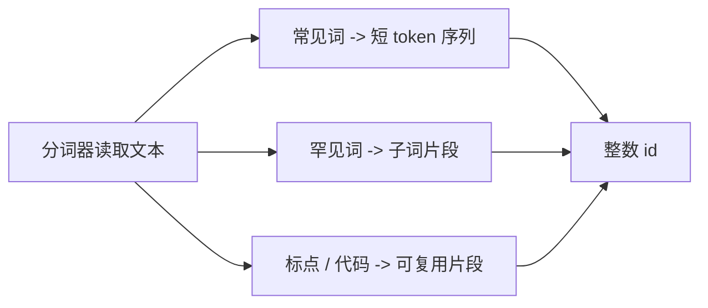
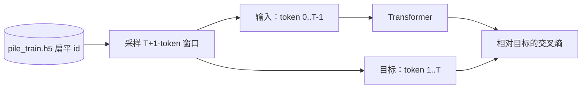

# 分词与数据形状

Transformer 从不会看到字符或单词；它只看到整数 token id。分词器是语言与张量之间的边界。

本仓库通过 `tiktoken` 使用 OpenAI 的 `r50k_base` 分词器，其配置为：

- 词表大小 `50304`；
- 文本终止 token `<|endoftext|>`，id 为 `50256`；
- 由于该分词器没有自定义对话 token，因此对话使用纯文本角色标记。

## 为什么需要子词分词

词级词表无法在大小不爆炸的前提下处理罕见姓名、拼写错误、代码标识符、URL 和新词。字符级词表能处理一切，却会使序列变得很长。子词分词则是一种折中：高频词可由一个 token 表示，罕见词可被拆分。



原始的 BPE 思想很简单：从小单元开始，反复合并高频相邻对，最终得到一个由可复用片段组成的固定词表。本仓库不训练自己的分词器，而是复用 `r50k_base`。

## 预训练形状：一条长 token 流

对于预训练，文档会被转换为一个扁平数组：

\[
[d_1, \text{EOT}, d_2, \text{EOT}, \ldots, d_N, \text{EOT}]
\]

`scripts/prepare_pretrain_data.py` 会流式读取 Pile 分片、为文档分词、追加 EOT，并将结果写入 HDF5：

```python
for ids in enc.encode_ordinary_batch(docs):
    buf.extend(ids)
    buf.append(EOT_ID)
    if len(buf) >= WRITE_CHUNK:
        flush()
```

训练数据加载器会截取长度为 `context_length + 1` 的随机窗口。前 `context_length` 个 token 是输入，之后的 `context_length` 个 token 是右移一位的目标：

\[
x = [t_0, t_1, \ldots, t_{T-1}]
\]

\[
y = [t_1, t_2, \ldots, t_T]
\]

这个移位就是下一个 token 预测任务的全部。



## SFT 形状：token 加损失掩码

SFT 样本是对话。我们希望模型学习助手回答，而不是记住用户提示词。因此数据包含两个对齐数组：

- `tokens`：token id；
- `loss_mask`：助手补全 token 为 `1`，提示词 token 为 `0`。

对话模板是纯文本：

```text
<|user|>
{question}<|endoftext|><|assistant|>
{answer}<|endoftext|>
```

关键实现位于 `src/post_training/chat_template.py`：

```python
content_ids = _encode_ordinary(m["content"])
is_completion = role == "assistant"
ids.extend(content_ids)
mask.extend([1 if is_completion else 0] * len(content_ids))
ids.append(EOT_ID)
mask.append(1 if is_completion else 0)
```

掩码与 token id 对齐：

| 区段 | 示例 | 掩码 |
|---|---|---|
| 用户标记 | `<|user|>` | 0 |
| 用户问题 | `What is 2+2?` | 0 |
| 助手标记 | `<|assistant|>` | 0 |
| 助手答案 | `<answer>4</answer>` | 1 |
| 助手 EOT | `<|endoftext|>` | 1 |

## 偏好形状：prompt、chosen、rejected

偏好学习使用成对数据：

```json
{"prompt": "...", "chosen": "...", "rejected": "..."}
```

两个回复共享同一个 prompt。这一点很重要，因为 DPO 和奖励建模应该比较答案质量，而不是提示词难度。

对于一个 batch，数据加载器会创建两条分词后的序列：

\[
\text{chosen ids} = \text{chat}(prompt, chosen)
\]

\[
\text{rejected ids} = \text{chat}(prompt, rejected)
\]

为组成 batch，chosen 和 rejected 两侧会被填充到相同长度。本仓库会跟踪真实序列长度，因此奖励模型读取的是最后一个真实 token，而不是填充 token。

## RL 提示词形状：提示词加可验证标准答案

PPO 和 GRPO 需要能在生成后评分的提示词：

```json
{"prompt": "Jan has 3 apples...", "gold": "12"}
```

验证器会提取模型最终答案并将其与 `gold` 比较。这称为可验证奖励，因为训练信号不需要人工标注者或学习得到的奖励模型。

## 常见形状错误

| 错误 | 表现 | 预防方法 |
|---|---|---|
| 目标未移位 | 模型学会复制当前 token。 | 始终使用 `tokens[:, :-1]` 预测 `tokens[:, 1:]`。 |
| SFT 损失包含提示词 token | 模型浪费容量预测用户输入。 | 使用 `loss_mask`，且仅在掩码位置上求平均。 |
| 缺失 EOT | 模型不知道何时停止。 | 在文档和助手消息后加入 EOT。 |
| 偏好 prompt 不一致 | 奖励 / DPO 比较了不同任务。 | 标准化为共享 prompt 加 chosen / rejected 回复。 |
| 将填充用作奖励位置 | 奖励模型在无意义的 pad 隐藏状态上训练。 | 跟踪 `seq_lengths`，并取最后一个真实 token。 |

## 下一步

文本完成分词后，模型需要将 id 转换为向量。继续阅读[仅解码器 Transformer](transformer_zh.md)。
