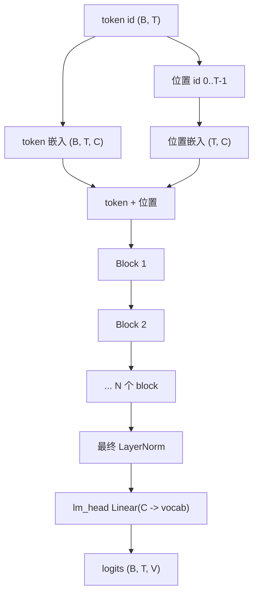

# 仅解码器 Transformer

本仓库实现了 GPT 风格的仅解码器 Transformer。“仅解码器”意味着：

- 模型读取一条 token 序列；
- 每个位置只能关注先前位置；
- 每个位置的输出都是下一个 token 上的概率分布。

它非常适合自回归语言建模：

\[
p_\theta(x_t \mid x_{<t})
\]

## 前向传播



实现位于 `src/models/transformer.py`：

```python
self.token_embed = nn.Embedding(vocab_size, n_embed)
self.position_embed = nn.Embedding(context_length, n_embed)
self.attn_blocks = nn.ModuleList([
    Block(n_head, n_embed, context_length) for _ in range(N_BLOCKS)
])
self.layer_norm = nn.LayerNorm(n_embed)
self.lm_head = nn.Linear(n_embed, vocab_size)
```

本文档中使用的形状符号：

| 符号 | 含义 |
|---|---|
| `B` | batch size |
| `T` | 序列长度 / 上下文长度 |
| `C` | 嵌入宽度，即 `n_embed` |
| `H` | 注意力头数量 |
| `D` | 单头宽度，通常为 `C / H` |
| `V` | 词表大小 |

## 嵌入

Token id 是类别值。嵌入表是一个可学习的查找表：

\[
E_{\text{tok}} \in \mathbb{R}^{V \times C}
\]

对于 token id \(x_t\)，其 token 向量为：

\[
e_t = E_{\text{tok}}[x_t]
\]

模型还会学习绝对位置嵌入：

\[
E_{\text{pos}} \in \mathbb{R}^{T_{\max} \times C}
\]

第一个 block 的输入为：

\[
h_t^{(0)} = E_{\text{tok}}[x_t] + E_{\text{pos}}[t]
\]

代码如下：

```python
tok_embedding = self.token_embed(idx)
pos_embedding = self.position_embed(self.pos_idxs[:T])
return tok_embedding + pos_embedding
```

位置嵌入是必要的，因为单独的注意力对排列是等变的：若没有位置信息，模型将不知道一个 token 是出现在开头、结尾还是中间。

## Transformer block

`src/models/transformer_block.py` 中的每个 block 使用 pre-norm 残差结构：

```python
x = x + self.attn(self.ln1(x))
x = x + self.mlp(self.ln2(x))
```

数学上：

\[
u = x + \text{MHA}(\text{LN}(x))
\]

\[
y = u + \text{MLP}(\text{LN}(u))
\]

这赋予每个 block 两项工作：

- 注意力在 token 位置之间传递信息；
- MLP 独立地变换每个位置。

## 为什么残差连接重要

残差 block 学习的是更新，而不是完整替换：

\[
y = x + f(x)
\]

如果一个层暂时还没有作用，它可以学习一个很小的更新，让信息直接通过。由于梯度可沿加法直接向后传递，这使深层堆栈也可训练。

## 为什么 LayerNorm 出现在子层之前

LayerNorm 会在特征维度上归一化每个 token 向量：

\[
\text{LN}(x) = \gamma \odot \frac{x - \mu}{\sqrt{\sigma^2 + \epsilon}} + \beta
\]

对于 token 向量 \(x \in \mathbb{R}^{C}\)：

\[
\mu = \frac{1}{C} \sum_{i=1}^{C} x_i
\]

\[
\sigma^2 = \frac{1}{C} \sum_{i=1}^{C} (x_i - \mu)^2
\]

本仓库使用 pre-norm（`LN -> sublayer -> residual`），而不是 post-norm（`sublayer -> residual -> LN`）。在 GPT 类模型中，pre-norm 很常见，因为它通常让更深的堆栈更易优化。

## MLP / 前馈网络

`src/models/mlp.py` 中的 block MLP 为：

```python
self.hidden = nn.Linear(n_embed, 4 * n_embed)
self.relu = nn.ReLU()
self.proj = nn.Linear(4 * n_embed, n_embed)
```

对每个位置独立地：

\[
\text{MLP}(x) = W_2 \, \text{ReLU}(W_1 x + b_1) + b_2
\]

其中：

- \(W_1\) 将维度从 \(C\) 扩展到 \(4C\)；
- \(W_2\) 将维度从 \(4C\) 投影回 \(C\)。

注意力使 token 之间可以通信。MLP 则在通信后为每个 token 向量提供非线性计算。

## Logits 与语言模型头

经过最后一个 block 和最终归一化后：

\[
z_t = W_{\text{lm}} h_t + b_{\text{lm}}
\]

结果 \(z_t \in \mathbb{R}^{V}\) 是一个 logits 向量：词表中每个 token 对应一个未归一化分数。

概率分布来自 softmax：

\[
p_\theta(x_{t+1}=i \mid x_{\leq t}) =
\frac{\exp(z_{t,i})}{\sum_{j=1}^{V}\exp(z_{t,j})}
\]

## 参数量直觉

忽略偏置和归一化层后，每个 block 的粗略参数量估计为：

\[
\text{attention} \approx 4C^2
\]

因为 Q、K、V 和输出投影各自都是 \(C \times C\)。

\[
\text{MLP} \approx 8C^2
\]

因为有 \(C \to 4C\) 和 \(4C \to C\) 两次变换。

因此，每个 block 大约为：

\[
12C^2
\]

嵌入和 LM head 额外加入：

\[
V C + C V
\]

本仓库没有绑定 token 嵌入与输出嵌入，因此输入嵌入和 `lm_head` 是独立的参数矩阵。

## 仓库特定的架构说明

| 选择 | 仓库实现 | 结果 |
|---|---|---|
| 可学习的绝对位置 | `nn.Embedding(context_length, n_embed)` | 简单且易读；最大上下文固定。 |
| 因果注意力掩码 | 每个头中的下三角 buffer | 防止未来 token 泄漏。 |
| MLP 激活函数 | ReLU | 教学上简单；许多生产 GPT 模型使用 GELU / SwiGLU 变体。 |
| Dropout | 基础模块中未使用 | 减少代码干扰；正则化主要来自数据与优化器选择。 |
| 权重绑定 | 未使用 | 更易理解；比绑定嵌入有更多参数。 |
| 后训练头 | 使用 `forward_hidden` | 奖励 / 价值头复用同一主干。 |

## 下一步

最重要的子层是注意力。继续阅读[注意力、掩码与头](attention_zh.md)。
